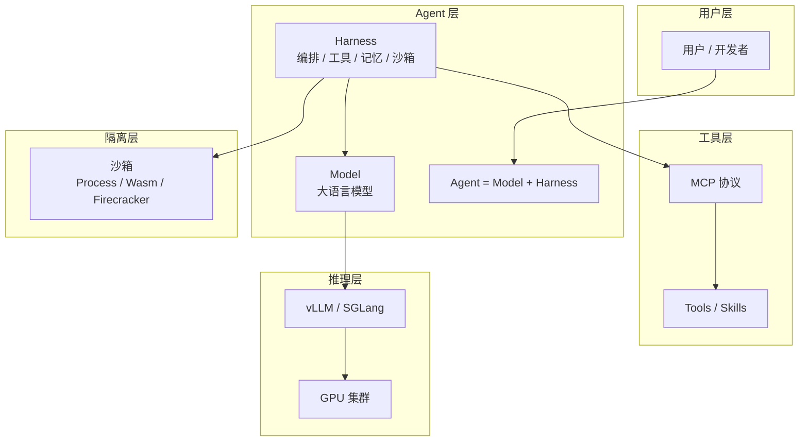

# Agent Handbook

> 用图解和通俗语言，讲清楚 AI Agent 生态里的核心概念。

这是一份**学习笔记型仓库**，面向想系统理解 Agent、MCP、沙箱隔离、大模型推理框架的工程师。每一章都力求：**概念清晰、结构调理、配图易懂**。

## 目录

| 章节 | 主题 | 你会学到 |
|------|------|----------|
| [01 - 什么是 Agent？](docs/01-what-is-agent.md) | Agent 智能体 | Model + Harness = Agent、Agent Loop、Tool Use |
| [02 - 什么是 MCP？](docs/02-what-is-mcp.md) | Model Context Protocol | 工具协议、Client/Server、与 Function Calling 的关系 |
| [03 - 什么是 Firecracker？](docs/03-what-is-firecracker.md) | 微虚拟机沙箱 | 容器 vs VM、为什么 Agent 需要沙箱 |
| [04 - vLLM 详解](docs/04-vllm-explained.md) | 大模型推理框架 | PagedAttention、连续批处理、部署架构 |
| [05 - SGLang 详解](docs/05-sglang-explained.md) | 大模型推理框架 | RadixAttention、前端语言、与 vLLM 对比 |
| [06 - 沙箱与 K8s 调度](docs/06-sandbox-and-k8s.md) | Agent 安全执行 | 三级隔离、SandboxScheduler、RuntimeClass |

## 概念关系总览

## 推荐阅读顺序

1. **先读 Agent** — 理解「智能体」到底是什么
2. **再读 MCP** — 理解 Agent 如何调用外部工具
3. **然后读 Firecracker** — 理解 Agent 如何安全执行不可信代码
4. **最后读 vLLM / SGLang** — 理解大模型如何在生产环境高效推理

## 关联项目

- [agent-harness-rs](https://github.com/huangyuantao19920411/agent-harness-rs) — Rust 实现的 Agent Harness 参考框架
- [agent-handbook](https://github.com/huangyuantao19920411/agent-handbook) — 本仓库，概念学习手册

## License

MIT
