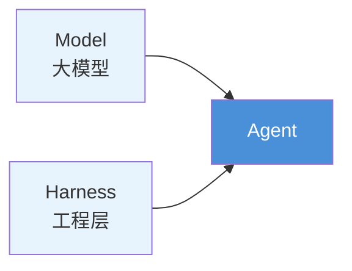
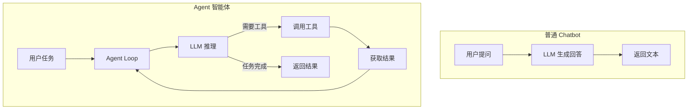
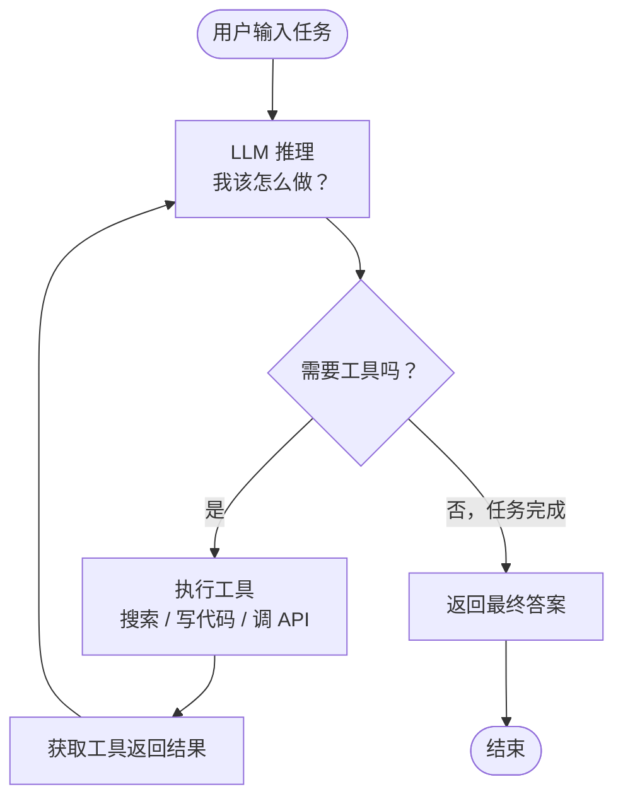
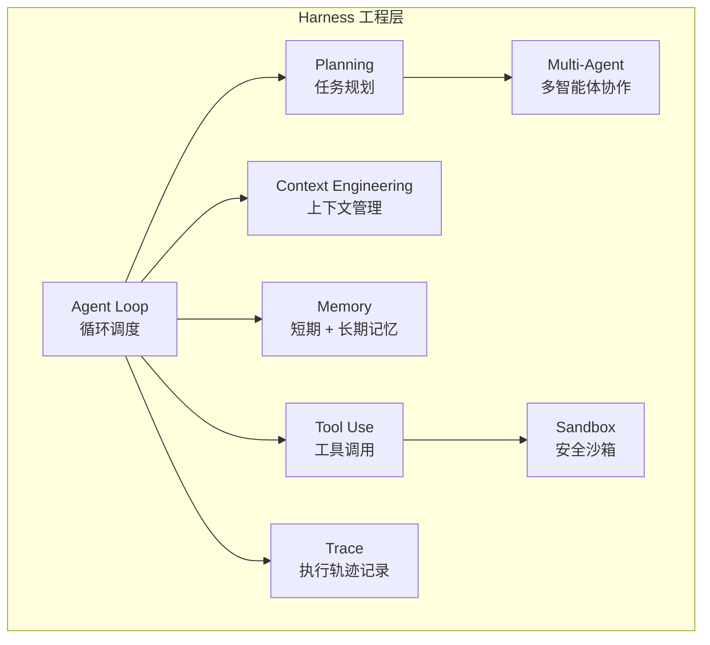
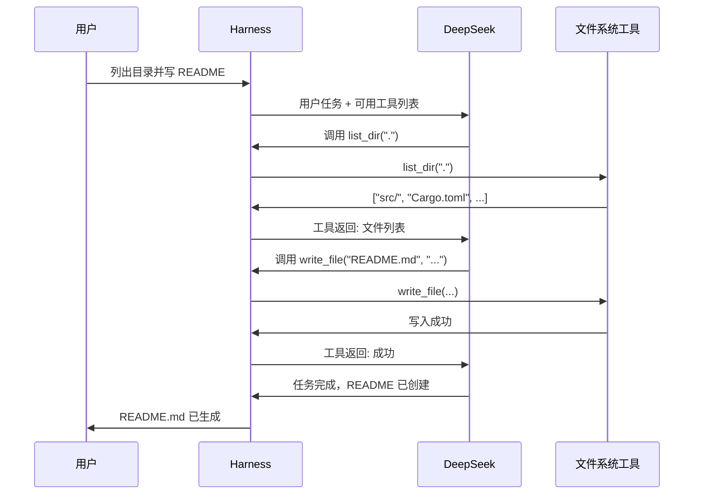

# 01 - 什么是 Agent（智能体）？

## 一句话定义

> **Agent = 能自主感知环境、做出决策、执行动作的大模型应用。**

普通 Chatbot 只会「聊天」，Agent 能「做事」。

---

## 核心公式

**Model + Harness = Agent**

| 组件 | 是什么 | 举例 |
|------|--------|------|
| **Model** | 大语言模型，负责「思考」 | DeepSeek-V3、GPT-4、Claude |
| **Harness** | 模型之外让 Agent 跑起来的全部工程 | Agent Loop、工具调用、记忆、沙箱 |
| **Agent** | 两者组合后的完整智能体 | 代码助手、研究 Agent、客服机器人 |

---

## Agent vs Chatbot

| | Chatbot | Agent |
|---|---------|-------|
| 交互模式 | 单轮问答 | 多轮自主循环 |
| 能力边界 | 只能生成文本 | 能调用工具、执行代码、操作外部系统 |
| 典型场景 | 聊天、问答 | 写代码、做研究、自动化流程 |

---

## Agent Loop（智能体循环）

Agent 的核心运行机制是 **Loop（循环）**：

这个循环叫做 **ReAct**（Reasoning + Acting）：

1. **Reason** — LLM 分析当前状态，决定下一步
2. **Act** — 调用工具执行动作
3. **Observe** — 把工具结果喂回 LLM
4. 重复，直到任务完成

---

## Harness 包含什么？

每一层解决一个具体问题：

| 模块 | 解决什么问题 |
|------|-------------|
| **Agent Loop** | 怎么让 LLM 反复推理直到任务完成？ |
| **Tool Use** | 怎么让 LLM 调用外部 API、执行代码？ |
| **Context Engineering** | 上下文窗口有限，怎么管理长对话？ |
| **Memory** | 跨会话怎么记住用户偏好和历史？ |
| **Planning** | 复杂任务怎么拆解成步骤？ |
| **Multi-Agent** | 多个 Agent 怎么协作？ |
| **Trace** | 怎么记录和回放 Agent 的每一步？ |
| **Sandbox** | 怎么安全执行 AI 生成的不可信代码？ |

---

## 一个具体例子：代码 Agent

用户说：「帮我列出当前目录的文件，然后写一个 README」

---

## 常见 Agent 产品

| 产品 | 类型 | 特点 |
|------|------|------|
| **Claude Code** | 代码 Agent | 终端内自主写代码、跑测试 |
| **Cursor** | 代码 Agent | IDE 内 Vibe Coding |
| **Manus** | 通用 Agent | 浏览器自动化、多步任务 |
| **OpenClaw** | 生活助理 | 日程、邮件、个人事务 |

---

## 关键术语速查

| 术语 | 含义 |
|------|------|
| **Agent Loop** | 推理 → 行动 → 观察 的循环 |
| **Tool Use** | LLM 调用外部工具的能力 |
| **Function Calling** | OpenAI 格式的工具调用 API |
| **MCP** | 标准化的工具协议（见下一章） |
| **Harness** | Model 之外的全部工程层 |
| **Context Engineering** | 上下文窗口的管理与优化 |
| **ReAct** | Reason + Act 的 Agent 推理模式 |

---

[下一章：什么是 MCP？ →](02-what-is-mcp.md)
