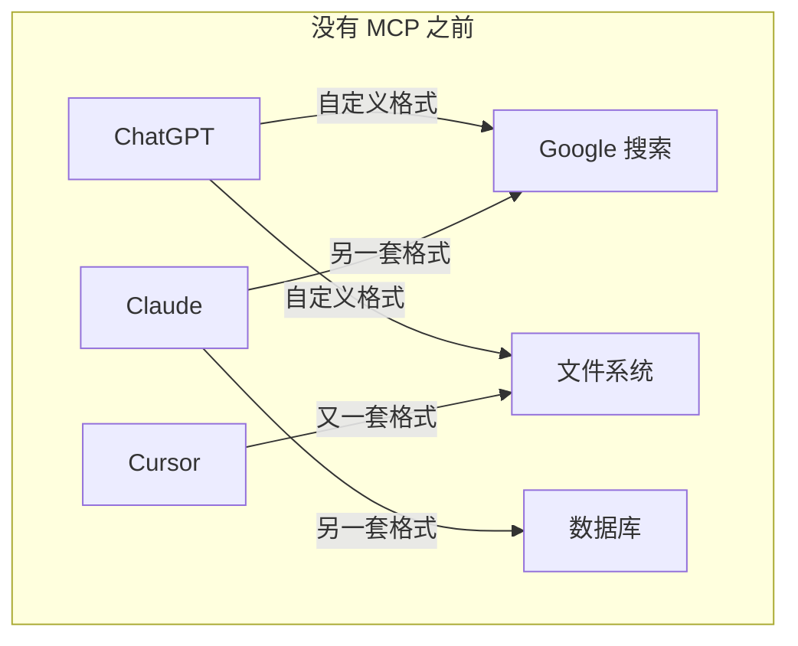
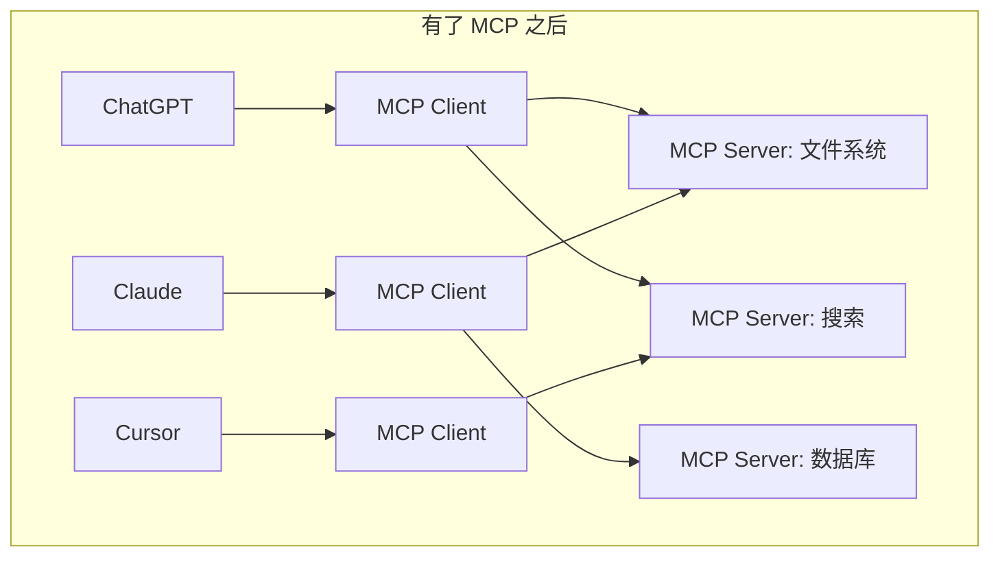
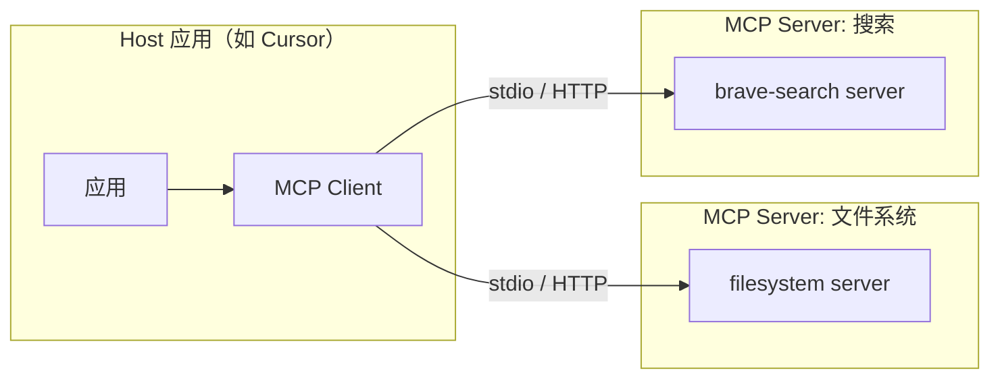
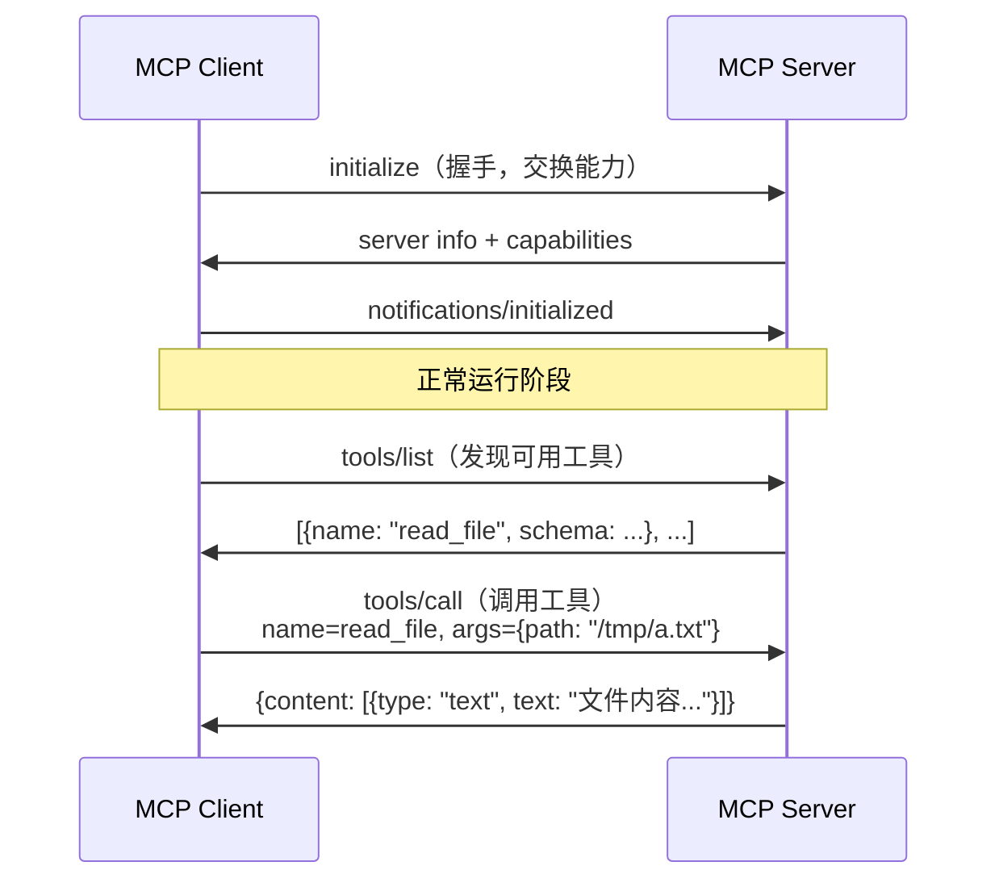
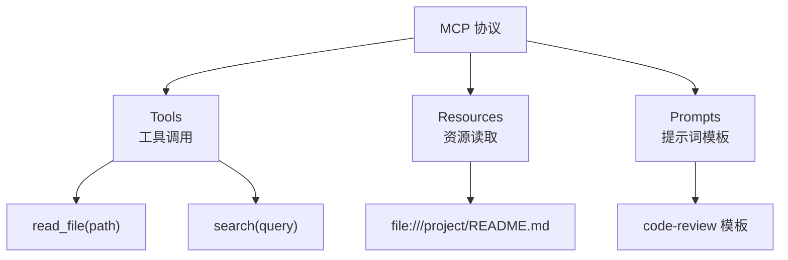
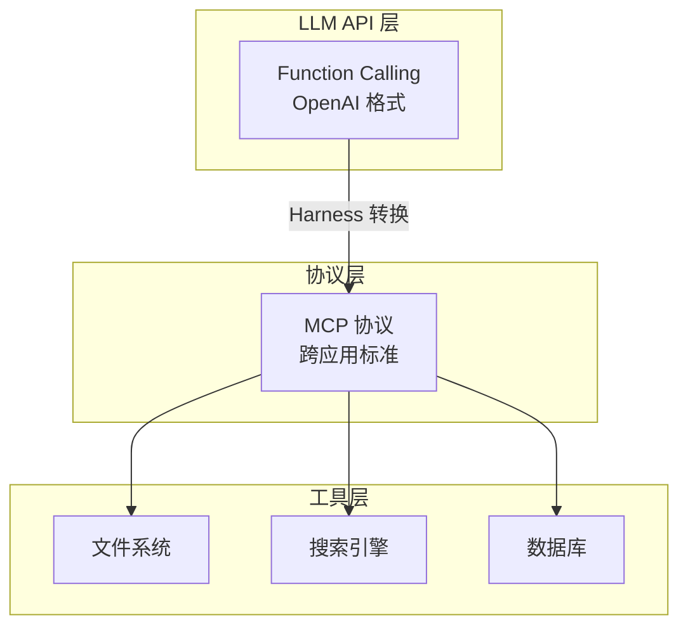

# 02 - 什么是 MCP（Model Context Protocol）？

## 一句话定义

> **MCP 是一种标准化协议，让 AI 模型能以统一方式发现和调用外部工具。**

可以把它理解为：**AI 世界的 USB 接口** —— 插上就能用，不用每个工具都写一套对接代码。

---

## 为什么需要 MCP？

在 MCP 出现之前，每个 AI 应用对接工具的方式都不一样：



问题：
- 每个 App 都要为每个工具写适配代码（N × M 问题）
- 工具提供方要为每个 App 单独开发集成
- 没有统一的权限、安全、观测标准

有了 MCP 之后：



**一次开发 MCP Server，所有支持 MCP 的 Client 都能用。**

---

## MCP 架构



| 角色 | 职责 | 类比 |
|------|------|------|
| **Host** | 运行 AI 模型的应用（Cursor、Claude Desktop） | 操作系统 |
| **MCP Client** | Host 内的协议客户端，发现和调用 Server | USB 驱动 |
| **MCP Server** | 暴露工具能力的独立进程 | USB 设备 |

---

## MCP 通信流程



底层传输协议：**JSON-RPC 2.0**，支持两种传输方式：

| 传输 | 方式 | 适用场景 |
|------|------|----------|
| **stdio** | 标准输入/输出 | 本地进程，如 `npx @modelcontextprotocol/server-filesystem` |
| **HTTP/SSE** | HTTP + Server-Sent Events | 远程服务，如云端 MCP Server |

---

## MCP 的三大能力



| 能力 | 作用 | 示例 |
|------|------|------|
| **Tools** | 让 LLM 执行动作 | 读文件、搜索网页、执行 SQL |
| **Resources** | 让 LLM 读取数据 | 项目文件、数据库记录 |
| **Prompts** | 预定义的提示词模板 | 代码审查模板、翻译模板 |

---

## MCP vs Function Calling

很多人混淆这两个概念，它们的关系是：



| | Function Calling | MCP |
|---|-----------------|-----|
| **层级** | LLM API 功能 | 独立协议标准 |
| **范围** | 单次 API 调用 | 跨应用、跨模型 |
| **格式** | 各家 LLM 格式不同 | 统一 JSON-RPC |
| **发现** | 手动注册工具 Schema | Server 自动暴露 tools/list |
| **关系** | Harness 把 MCP 工具转成 Function Calling 格式给 LLM | MCP 是更上层的标准化 |

**简单理解**：Function Calling 是「LLM 怎么调用工具」，MCP 是「工具怎么被发现和接入」。

---

## 实际使用示例

### 启动一个 MCP Server

```bash
# 文件系统 MCP Server
npx -y @modelcontextprotocol/server-filesystem /tmp

# GitHub MCP Server
npx -y @modelcontextprotocol/server-github
```

### 在 Agent Harness 中接入

```rust
// agent-harness-rs 示例
let config = McpClientConfig::new("npx")
    .arg("-y")
    .arg("@modelcontextprotocol/server-filesystem")
    .arg("/tmp");

let client = McpClient::connect(config).await?;
register_mcp_tools(client, &mut tool_registry).await?;
// 现在 LLM 可以通过 Agent Loop 调用 MCP 工具了
```

---

## 关键术语速查

| 术语 | 含义 |
|------|------|
| **MCP** | Model Context Protocol，模型上下文协议 |
| **MCP Client** | 发起连接、调用工具的一方（在 Host 应用内） |
| **MCP Server** | 暴露工具能力的一方（独立进程） |
| **stdio** | 通过标准输入/输出通信（本地最常用） |
| **tools/list** | 发现 Server 提供的所有工具 |
| **tools/call** | 调用指定工具 |
| **JSON-RPC 2.0** | MCP 底层使用的通信协议 |

---

[← 上一章：Agent](01-what-is-agent.md) | [下一章：Firecracker →](03-what-is-firecracker.md)
