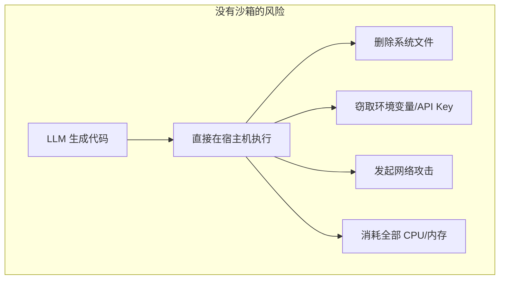
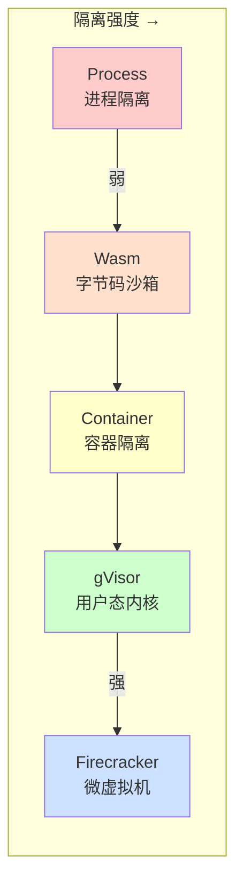
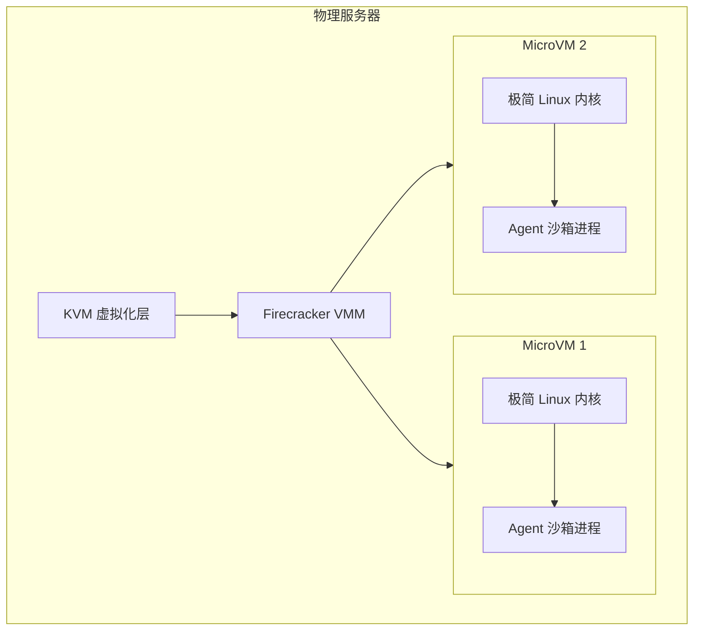
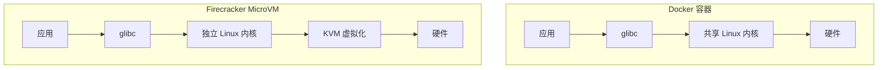
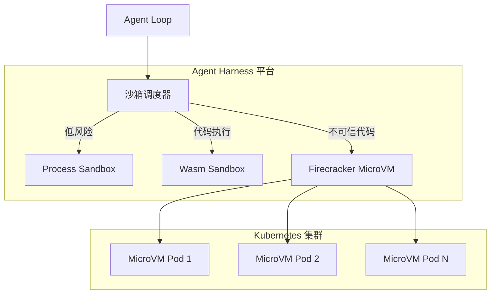
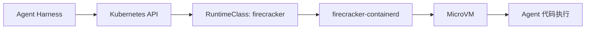

# 03 - 什么是 Firecracker（微虚拟机）？

## 一句话定义

> **Firecracker 是 AWS 开源的轻量级虚拟机管理器，用硬件虚拟化实现毫秒级启动和强安全隔离。**

它是 Agent 沙箱的「终极形态」之一 —— 当 AI 生成的代码不可信时，需要在硬件级别隔离执行。

---

## 为什么 Agent 需要沙箱？

Agent 能自主执行代码、调用系统命令。如果 LLM 生成了恶意代码：



**沙箱 = 给 AI 代码一个安全的「牢笼」，在里面运行，无法影响外部系统。**

---

## 隔离技术谱系

从轻到重，隔离技术有一个光谱：



| 技术 | 隔离原理 | 启动速度 | 安全级别 | 适用场景 |
|------|----------|----------|----------|----------|
| **Process** | 子进程 + 超时 | ~1ms | 低（共享内核） | Demo、可信工具 |
| **Wasm** | 字节码 + 内存安全 | ~1ms | 中（无 syscalls） | AI 生成代码 |
| **Container** | Linux Namespace | ~100ms | 中（共享内核） | 常规服务部署 |
| **gVisor** | 用户态内核拦截 syscall | ~100ms | 高 | 不可信代码（Linux） |
| **Firecracker** | KVM 硬件虚拟化 | ~125ms | 最高 | 多租户 Agent 平台 |

---

## Firecracker 是什么？



Firecracker 的关键设计：

| 特点 | 说明 |
|------|------|
| **MicroVM** | 极简虚拟机，只模拟必要设备（键盘、串口、网络） |
| **KVM 加速** | 利用 CPU 硬件虚拟化，性能接近原生 |
| **125ms 启动** | 比传统 VM（数秒）快 10-100 倍 |
| **< 5MB 内存** | 每个 MicroVM 开销极小 |
| **安全优先** | 最小设备模型 = 最小攻击面 |

---

## Firecracker vs Docker 容器



| | Docker 容器 | Firecracker MicroVM |
|---|------------|---------------------|
| **隔离级别** | 进程级（Namespace） | 硬件级（KVM） |
| **内核** | 共享宿主机内核 | 每个 VM 独立内核 |
| **启动时间** | ~100ms | ~125ms |
| **内存开销** | ~10MB | ~5MB |
| **安全模型** | 信任内核不被突破 | 即使内核被攻破也不影响宿主机 |
| **典型用途** | 微服务部署 | 多租户不可信代码执行 |

**关键区别**：容器里容器逃逸（Container Escape）可以影响宿主机；MicroVM 里即使 VM 内内核被攻破，也无法突破 KVM 虚拟化层。

---

## Agent 平台的沙箱架构



### 为什么不建议自研 Firecracker？

| 维度 | 自研 | 集成现有方案 |
|------|------|-------------|
| 开发周期 | 1-2 年+ | 数周 |
| 安全审计 | 需要专业团队 | AWS 已生产验证 |
| 维护成本 | 持续跟进内核 CVE | 上游维护 |
| 我们的价值 | 在 VM 层以下 | **在调度编排层** |

**正确做法**：通过 K8s RuntimeClass 集成 Firecracker/gVisor，自己专注做 Harness 层的沙箱调度、生命周期管理和 Trace。

---

## 实际集成方式

不直接调用 Firecracker API，而是通过容器生态集成：



```yaml
# Kubernetes RuntimeClass 示例
apiVersion: node.k8s.io/v1
kind: RuntimeClass
metadata:
  name: firecracker
handler: fc-run  # firecracker-containerd handler
```

---

## 关键术语速查

| 术语 | 含义 |
|------|------|
| **Firecracker** | AWS 开源的 MicroVM 管理器 |
| **MicroVM** | 极简虚拟机，最小设备模型 |
| **KVM** | Linux 内核虚拟化模块，硬件加速 |
| **VMM** | Virtual Machine Monitor，虚拟机监视器 |
| **Container Escape** | 容器逃逸，突破 Namespace 隔离 |
| **RuntimeClass** | K8s 选择容器运行时的机制 |
| **gVisor** | Google 的用户态内核，syscall 拦截方案 |

---

[← 上一章：MCP](02-what-is-mcp.md) | [下一章：vLLM →](04-vllm-explained.md)
