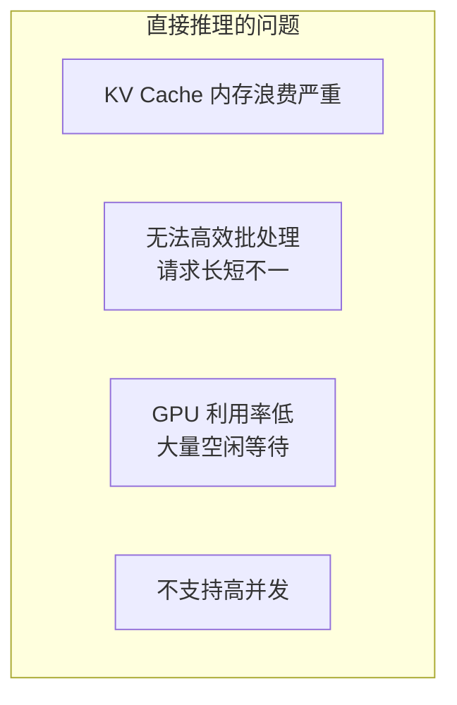
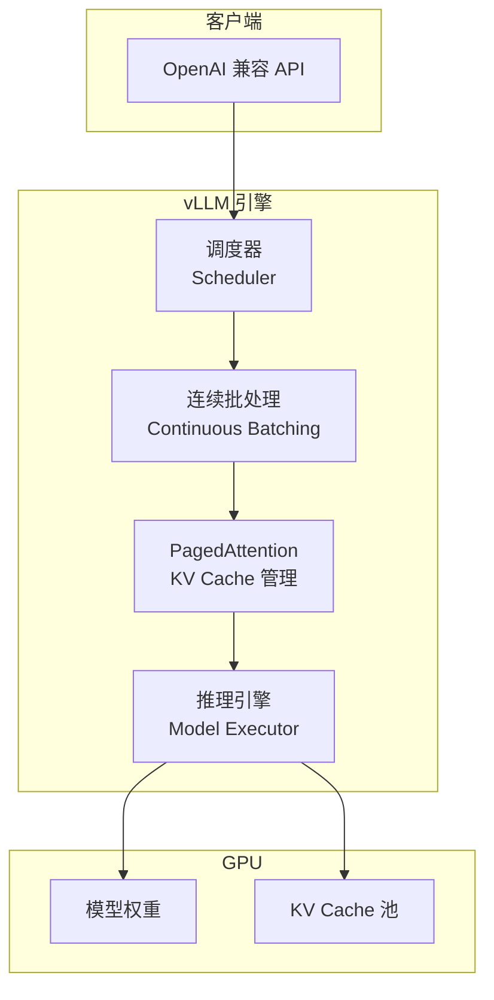
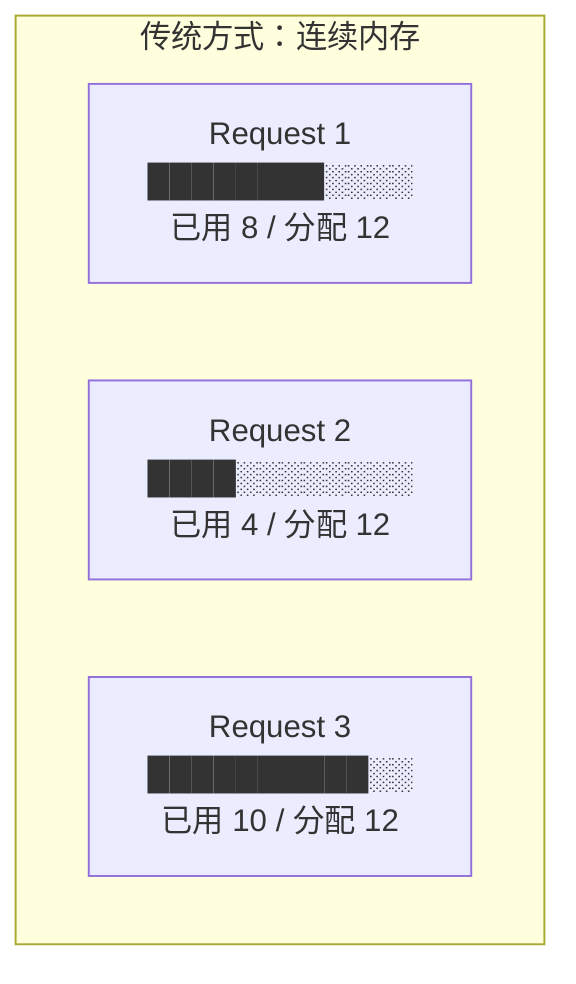
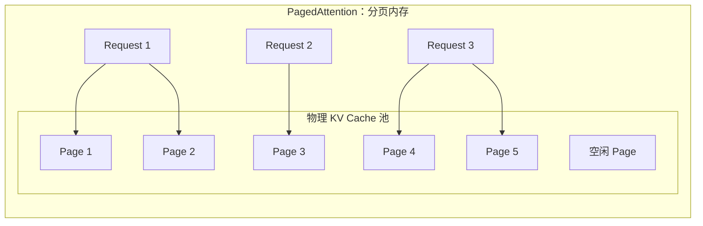
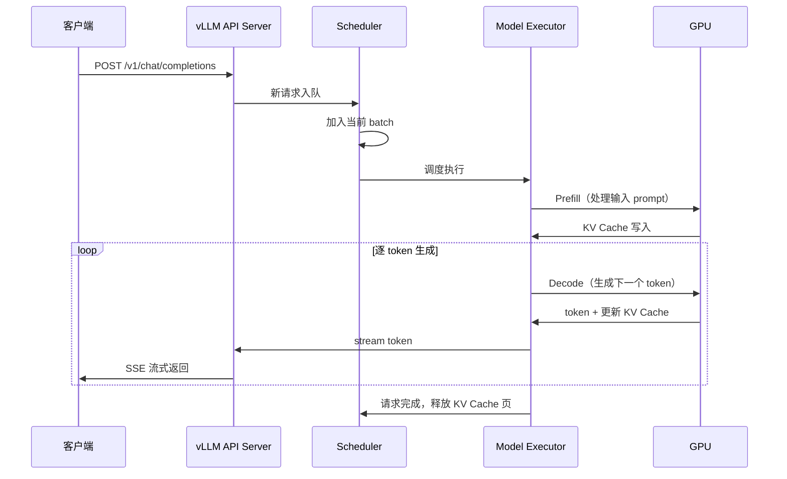
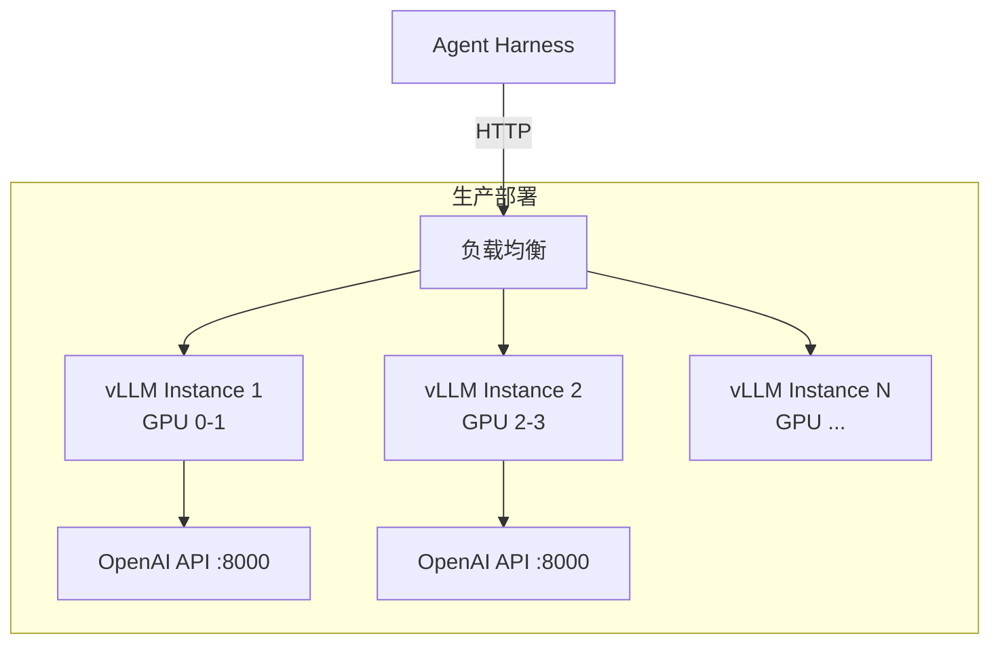

# 04 - vLLM 详解

## 一句话定义

> **vLLM 是一个高性能大模型推理引擎，通过 PagedAttention 和连续批处理，让 LLM 在生产环境中高效服务大量并发请求。**

如果说 PyTorch 是「训练框架」，vLLM 就是「推理 serving 框架」—— 专门解决「怎么让大模型又快又省地跑在生产环境」。

---

## 为什么需要推理框架？

直接用 HuggingFace `model.generate()` 做生产服务的问题：



vLLM 解决了这些核心问题。

---

## vLLM 架构



---

## 核心创新 1：PagedAttention

### 问题：KV Cache 内存浪费

LLM 推理时，每生成一个 token 都需要缓存 Key/Value 向量（KV Cache）。传统方式是连续分配：



问题：每个请求预分配最大长度的内存，实际使用往往不到一半 → **内存浪费 50-80%**。

### 解决：分页式 KV Cache

借鉴操作系统虚拟内存的分页思想：



效果：
- 内存浪费从 **50-80%** 降到 **< 4%**
- 同样 GPU 内存可以服务 **2-4 倍** 更多请求

---

## 核心创新 2：Continuous Batching

### 问题：静态批处理效率低

```mermaid
gantt
    title 静态批处理（等待最慢请求）
    dateFormat X
    axisFormat %s

    section Request A (短)
    生成 :a1, 0, 3

    section Request B (长)
    生成 :b1, 0, 8

    section Request C (中)
    生成 :c1, 0, 5

    section GPU 等待
    空闲等待 B 完成 :crit, 3, 8
```



Request A 3 秒就完成了，但 GPU 要等最慢的 Request B（8 秒）才能处理下一批。

### 解决：连续批处理

```mermaid
gantt
    title 连续批处理（完成即退出，新请求立即加入）
    dateFormat X
    axisFormat %s

    section Request A
    生成 :a1, 0, 3

    section Request B
    生成 :b1, 0, 8

    section Request C
    生成 :c1, 0, 5

    section Request D (新)
    生成 :d1, 3, 8
```



A 完成后，新 Request D 立即加入当前 batch，GPU 不空闲。

---

## vLLM 请求处理流程



---

## 部署架构



### 启动命令

```bash
# 单卡部署
python -m vllm.entrypoints.openai.api_server \
    --model deepseek-ai/DeepSeek-V3 \
    --tensor-parallel-size 1

# 多卡并行
python -m vllm.entrypoints.openai.api_server \
    --model deepseek-ai/DeepSeek-V3 \
    --tensor-parallel-size 8
```

Agent Harness 通过 OpenAI 兼容 API 调用 vLLM，无需特殊适配。

---

## 关键术语速查

| 术语 | 含义 |
|------|------|
| **vLLM** | 高性能 LLM 推理引擎（UC Berkeley 出品） |
| **PagedAttention** | 分页式 KV Cache 管理，大幅减少内存浪费 |
| **Continuous Batching** | 连续批处理，完成即退出、新请求立即加入 |
| **KV Cache** | 存储历史 token 的 Key/Value 向量，避免重复计算 |
| **Prefill** | 处理输入 prompt 的阶段（计算密集） |
| **Decode** | 逐 token 生成的阶段（内存密集） |
| **Tensor Parallelism** | 模型权重切分到多 GPU |

---

[← 上一章：Firecracker](03-what-is-firecracker.md) | [下一章：SGLang →](05-sglang-explained.md)
