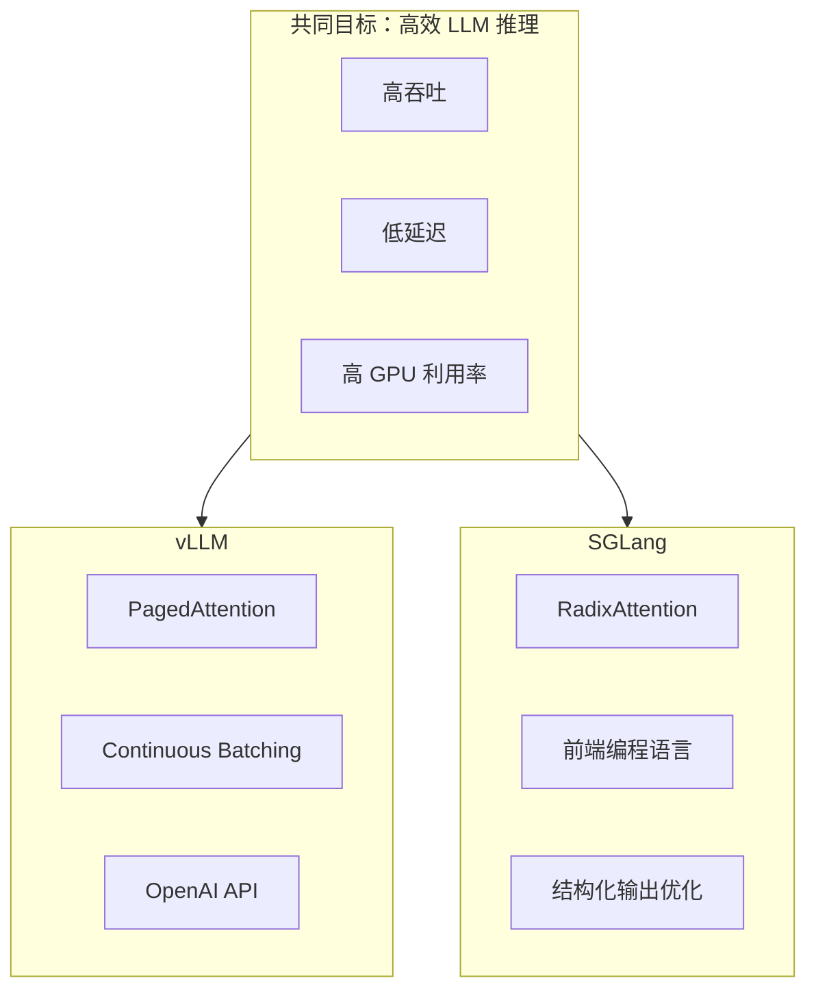
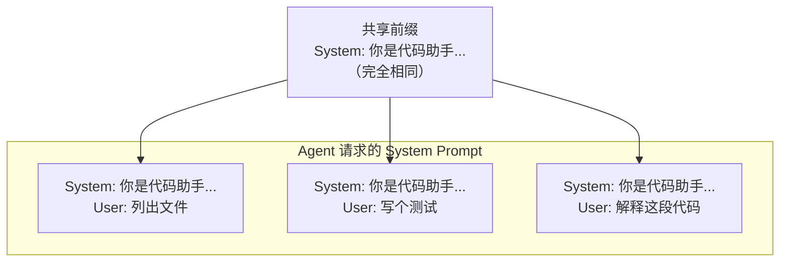
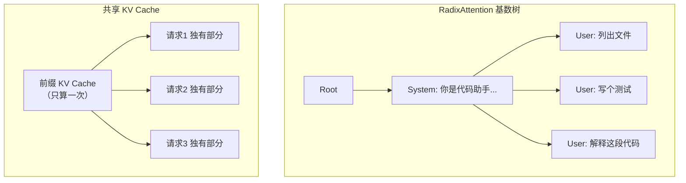
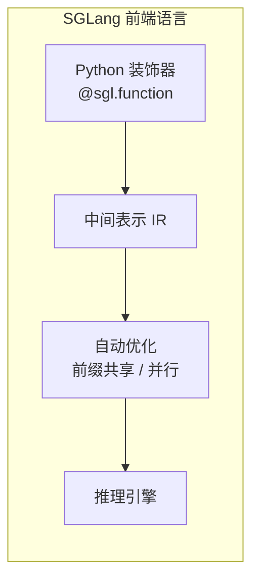
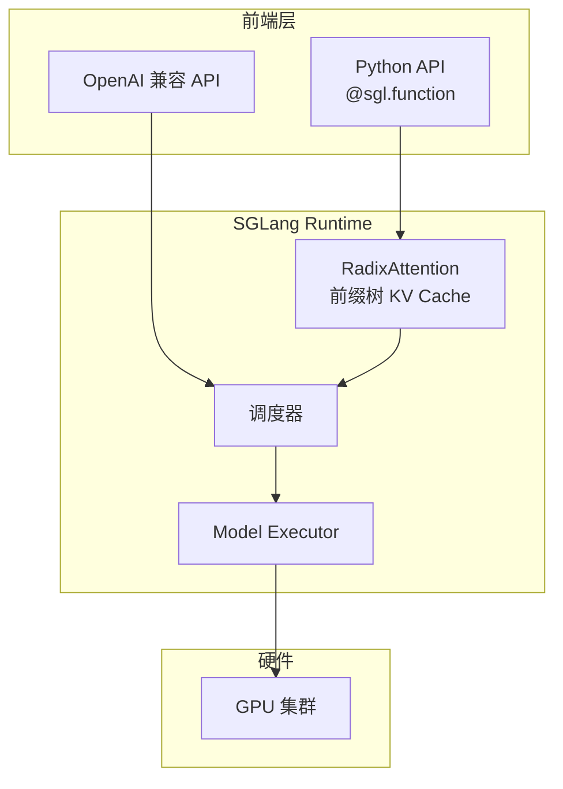
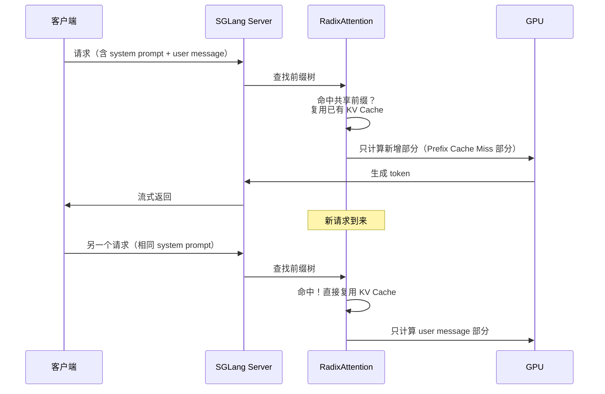
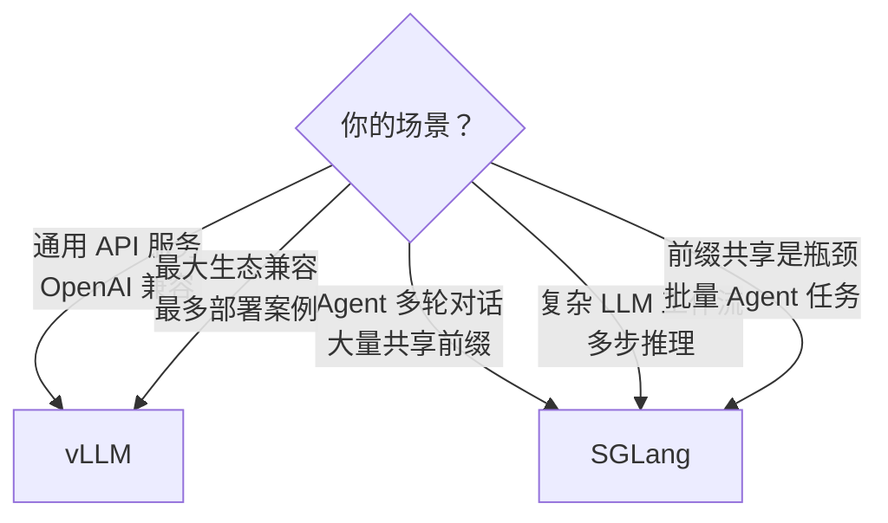
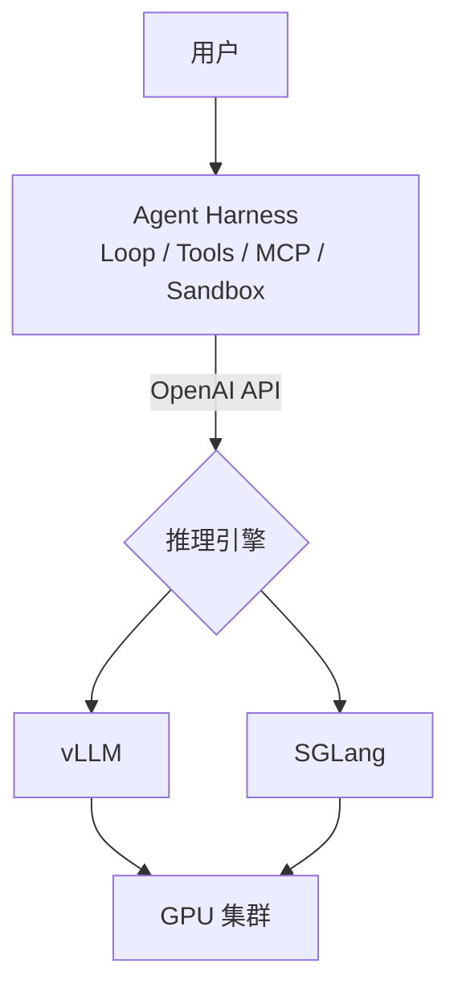

# 05 - SGLang 详解

## 一句话定义

> **SGLang 是一个高性能大模型推理框架，用 RadixAttention 和前端编程语言，让 LLM 推理更快、更灵活。**

与 vLLM 解决同样的问题（高效 LLM serving），但技术路线不同，各有优势。

---

## SGLang vs vLLM 定位



| | vLLM | SGLang |
|---|------|--------|
| **出品** | UC Berkeley (vLLM team) | LMSYS (Chatbot Arena 团队) |
| **核心创新** | PagedAttention | RadixAttention + SGLang 语言 |
| **强项** | 通用高吞吐 serving | 复杂 Agent 工作流、前缀共享 |
| **API** | OpenAI 兼容 | OpenAI 兼容 + 原生前端语言 |
| **适合场景** | 通用 API 服务 | Agent 多轮对话、批量推理 |

---

## 核心创新 1：RadixAttention

### 问题：Agent 场景大量重复前缀

Agent 应用中，很多请求共享相同的前缀：



传统 KV Cache：每个请求独立计算和存储前缀 → **重复计算浪费 GPU**。

### 解决：基数树（Radix Tree）共享前缀



效果：
- 相同前缀只计算 **一次** KV Cache
- Agent 多轮对话场景下吞吐量提升 **2-5 倍**
- 特别适合 System Prompt 长、多用户共享的场景

---

## 核心创新 2：SGLang 前端语言

SGLang 提供了一种专门描述 LLM 应用逻辑的编程语言：

```python
import sglang as sgl

@sgl.function
def code_assistant(s, task):
  s += sgl.system("You are a helpful coding assistant.")
  s += sgl.user(f"Task: {task}")
  s += sgl.assistant(sgl.gen("response", max_tokens=1024))

# 批量执行（自动共享前缀）
results = code_assistant.run_batch([
    {"task": "list files"},
    {"task": "write tests"},
    {"task": "explain code"},
])
```



对比普通 API 调用：

| | 普通 API 调用 | SGLang 前端语言 |
|---|-------------|----------------|
| 前缀共享 | 手动实现 | 自动（RadixAttention） |
| 批量推理 | 手动 batch | `run_batch()` 自动优化 |
| 多步逻辑 | 多次 API 调用 | 一个 function 描述完整流程 |
| 结构化输出 | 手动解析 | 原生支持 JSON/regex 约束 |

---

## SGLang 架构



---

## 请求处理流程



---

## 选型建议



| 场景 | 推荐 | 原因 |
|------|------|------|
| 通用 Chatbot API | vLLM | 生态成熟、部署案例多 |
| Agent 平台（多用户共享 System Prompt） | SGLang | RadixAttention 前缀共享 |
| 复杂多步 LLM 工作流 | SGLang | 前端语言描述逻辑 |
| 快速上线、OpenAI 兼容 | 两者都行 | 都支持 OpenAI API |
| 极致吞吐量 benchmark | 看具体场景 | 建议都测试 |

---

## 与 Agent Harness 的关系



Agent Harness 通过标准 OpenAI API 调用推理引擎，**底层用 vLLM 还是 SGLang 可以灵活切换**。

---

## 关键术语速查

| 术语 | 含义 |
|------|------|
| **SGLang** | 高性能 LLM 推理框架（LMSYS 出品） |
| **RadixAttention** | 基于基数树的前缀 KV Cache 共享 |
| **Radix Tree** | 基数树，高效存储和查找共享前缀 |
| **Prefix Caching** | 前缀缓存，相同 prompt 前缀只算一次 |
| **SGLang 语言** | 描述 LLM 应用逻辑的 Python DSL |
| **run_batch** | 批量执行，自动优化前缀共享和并行 |

---

[← 上一章：vLLM](04-vllm-explained.md) | [返回目录 →](../README.md)
