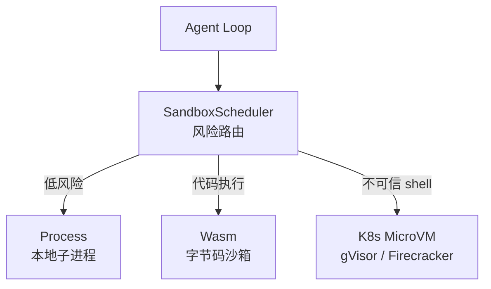
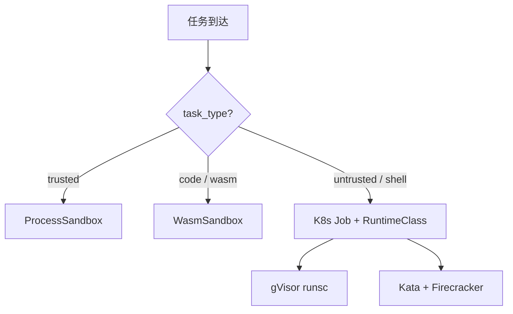
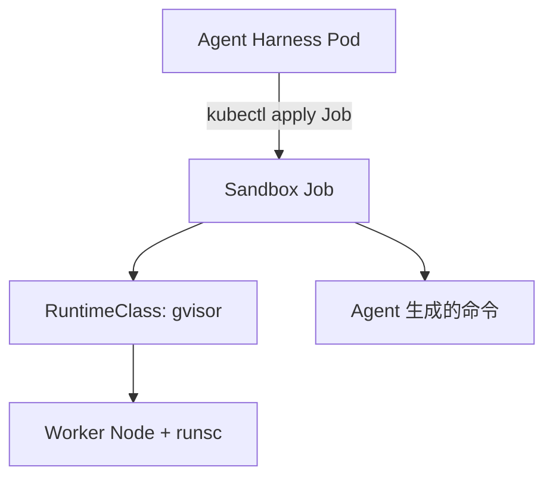

# 06 - Agent 沙箱与 K8s 调度

> Harness 如何根据任务风险，选择 Process / Wasm / MicroVM 三级隔离？

---

## 为什么需要沙箱调度？

Agent 能执行代码、调用 shell。LLM 生成的内容**不可信**，必须在隔离环境中运行。



---

## 三级隔离

| 级别 | 后端 | 启动 | 安全 | 场景 |
|------|------|------|------|------|
| Process | 子进程 + 超时 | ~1ms | 低 | Demo、可信工具 |
| Wasm | wasmtime | ~1ms | 中 | AI 生成代码 |
| MicroVM | K8s + RuntimeClass | ~125ms | 最高 | 不可信 shell |

详见 [Firecracker 章节](03-what-is-firecracker.md) 的隔离谱系图。

---

## SandboxScheduler 路由策略



```rust
// agent-harness-rs
let scheduler = SandboxScheduler::with_defaults()?;
scheduler.exec("trusted", "echo", &["hi"]).await?;      // Process
scheduler.exec_wasm(wat, "add", &[1, 2]).await?;         // Wasm
scheduler.exec("untrusted", "sh", &["-c", "cmd"]).await?; // K8s MicroVM
```

---

## K8s 部署架构



部署步骤见 [agent-harness-rs deploy/k8s](https://github.com/huangyuantao19920411/agent-harness-rs/tree/master/deploy/k8s)。

---

## 为什么不自研 Firecracker？

**集成，而非自研。** 我们的价值在 Harness 调度层：生命周期、风险路由、Trace。Firecracker/gVisor 通过 K8s RuntimeClass 接入即可。

---

[← 上一章：SGLang](05-sglang-explained.md) | [返回目录 →](../README.md)
